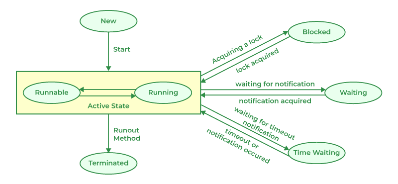

# 스레드 제어와 생명 주기1

## 스레드 생명 주기
- New: 스레드가 생성되었으나 시작되진 않은 상태
- Runnable: 스레드가 실행 중이거나 실행될 준비가 완료된 상태
- Blocked: 스레드가 동기화 락을 기다리는 상태
- Waiting: 스레드가 다른 스레드의 작업이 완료되길 무한정 기다리는 상태
- Timed Waiting: 스레드가 다른 스레드의 작업이 완료되길 일정 시간 동안 기다리는 상태
- Terminated: 스레드의 실행이 완료돼 종료된 상태



## `join`

### `join()`
- `join()`메서드를 호출한 부모 스레드는 자식 스레드가 `TERMINATED` 상태가 될 때까지 `WAITING` 상태임
- 자식 스레드가 `TERMINATED` 상태가 되면 부모 스레드는 다시 `RUNNABLE` 상태로 전환됨

```java
public class Join {
    public static void main(String[] args) {
        SumTask task1 = new SumTask(1, 50);
        SumTask task2 = new SumTask(51, 100);

        Thread thread1 = new Thread(task1);
        Thread thread2 = new Thread(task2);

        thread1.start();
        thread2.start();

        thread1.join();  // thread1 종료될 때까지 main 스레드 무한 대기
        thread2.join();  // thread2 종료될 때까지 main 스레드 무한 대기

        int totalSum = task1.result + task2.result;
        System.out.println("total sum: " + totalSum);
    }

    static class SumTask implements Runnable {
        int startValue;
        int endValue;
        int result = 0;

        public SumTask(int startValue, int endValue) {
            this.startValue = startValue;
            this.endValue = endValue;
        }

        @Override
        public void run() {
            int sum = 0;

            for (int i = startValue; i <= endValue; i++) {
                sum += i;
            }

            result = sum;
        }
    }
}
```

### `join(ms)`
- `join(ms)` 메서드를 호출한 부모 스레드는 지정한 시간만큼 `TIMED_WAITING` 상태로 대기함
- 부모 스레드는 지정한 시간이 지나면 다시 `RUNNABLE` 상태로 전환됨
