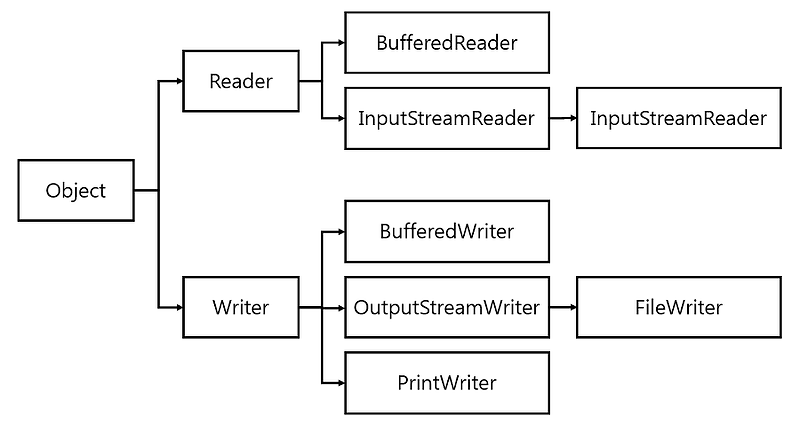

# IO 기본2

## `Reader`, `Writer`
- 스트림은 기본적으로 `byte`로 동작하기 때문에, 문자열을 주고받기 위해서는 `String`을 `byte`로 변환하거나, `byte`를 `String`으로 변환해야함
- 하지만 이러한 변환을 매번 직접 수행하는 것은 불편하므로, 자바에서는 문제 데이터를 쉽게 처리할 수 있도록 `Reader`와 `Writer` 추상 클래스를 제공함
- `Reader`는 입력 스트림에서 문자를 읽는 역할을, `Writer`는 출력 스트림에 문자를 쓰는 역할을 담당하며, 문자와 바이트 간의 변환 및 인코딩을 내부적으로 추상화함 
- 또한 성능 최적화를 위해 `BufferedReader`, `BufferedWriter`와 같은 버퍼링 클래스도 제공됨

## 정리

### 기본 스트림
- 파일, 메모리, 콘솔 등에 직접 접근하는 스트림
- 단독으로 사용 가능

#### 예시
- `FileInputStream`, `FileOutputStream`
- `FileReader`, `FileWriter`
- `ByteArrayInputStream`, `ByteArrayOutputStream`

### 보조 스트림
- 기본 스트림에 추가적인 기능을 제공하는 스트림
- 단독으로 사용할 수 없으며, 반드시 대상 기본 스트림이 필요함

#### 예시
- `BufferedInputStream`, `BufferedOutputStream`
- `InputStreamReader`, `OutputStreamWriter`
- `DataInputStream`, `DataOutputStream`
- `PrintStream`