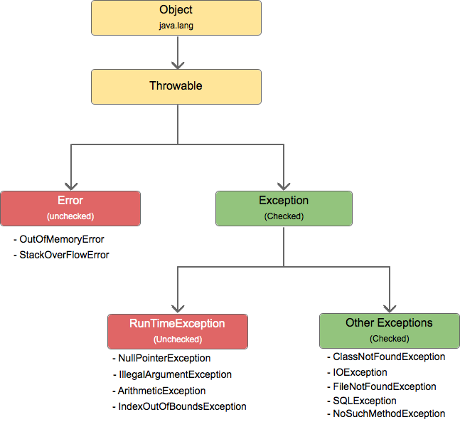

# 예외 처리1 - 이론

## 예외 계층 구조

- `Throwable`: 최상위 예외
- `Error`: 어플리케이션에서 복구 불가한 예외이므로 잡아선 안됨 
- `Exception`: 컴파일 예외, 체크 예외라고 부름
  - 어플리케이션 로직에서 사용 가능한 최상위 예외
  - 컴파일러가 예외 처리 여부를 체크하므로, 예외를 명시적으로 처리해야함
- `RuntimeException`: 런타임 예외, 언체크 예외라고 부름
  - 컴파일러가 예외 처리 여부를 체크하지 않으므로, 예외를 명시적으로 처리하지 않아도 됨

<br>

## 예외 처리의 기본 규칙
1. 예외는 잡히거나 던져질 수 있음
2. 예외를 잡거나 던질 때, 다형성을 활용할 수 있음

> 처리되지 않은 예외가 `main` 메서드 밖으로 던져지면 시스템이 비정상 종료되므로, 예외는 그 전에 결국 언젠가 처리돼야 함

<br>

## 커스텀 예외
- 커스텀 에외는 어플리케이션에서 발생 가능한 예외의 의미를 명확하게 전달하기 위해 사용함
- 커스텀 예외는 다음과 같이 정의할 수 있으며, `message`는 `Throwable`의 `detailMessage`에 저장됨
```java
// 체크 예외
public class MyCheckedException extends Exception {
    public MyCheckedException(String message) {
        super(message);
    }
}

// 언체크 예외
public class MyUncheckedException extends RuntimeException {
    public MyUncheckedException(String message) {
        super(message);
    }
}
```

<br>

## 체크 예외 vs 언체크 예외

### 체크 예외
- 장점: 예외를 빠뜨리지 않고 처리할 수 있으며, 메서드를 사용할 때 발생 가능한 예외를 명확하게 확인할 수 있음  
- 단점: 모든 체크 예외를 처리해야 하므로 번거로우며 코드가 복잡해짐

### 언체크 예외
- 장점: 코드의 간결성
- 단점: 중요한 예외 처리를 빠뜨릴 수 있으며, 메서드를 사용할 때 어떤 예외가 발생할지 예측하기 어려움

<br>

## finally
- 반드시 호출해야 하는 코드가 있을 때 `finally` 사용
- `finally` 블록은 어떤 경우라도 호출됨
- 일반적으로 획득한 자원을 해제할 때 사용

```java
try {
    // 정상
} catch {
    // 예외 처리
} finally {
    // 반드시 호출해야 하는 코드
}
```