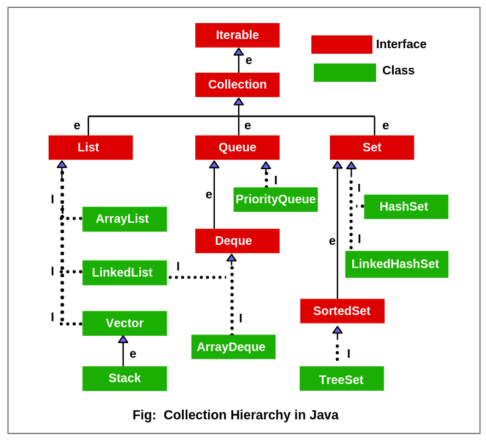

# 컬렉션 프레임워크 - `Set`

## `Set`
- 중복을 허용하지 않고 순서가 없는 자료구조로, 수학의 집합과 같은 개념임
- `Set`의 구현 클래스는 요소의 중복을 허용하지 않기 위해 내부적으로 `equals()`와 `hashCode()` 메서드를 사용하여 객체의 동일성을 판단함
- `HashSet`, `LinkedHashSet`, `TreeSet` 등의 여러 구현 클래스를 가짐

 

## `LinkedHashSet`
- `HashSet`에 이중 연결 리스트를 추가하여 요소의 삽입 순서를 유지
- 조회, 삽입, 삭제 연산이 O(1)의 시간 복잡도를 가짐
- 데이터의 삽입 순서가 중요한 경우 사용
- 연결 포인터를 유지해야하므로 `HashSet`에 비해 메모리 오버헤드 존재

## `TreeSet`
- 레드-블랙 트리 사용해 요소를 정렬된 상태로 저장함
- 조회, 삽입, 삭제 연산이 O(log n)의 시간 복잡도를 가짐
- 집합의 특성에 더해 데이터를 정렬된 순서로 유지해야하는 경우 사용(e.g. 범위 검색이 필요한 경우 등)
