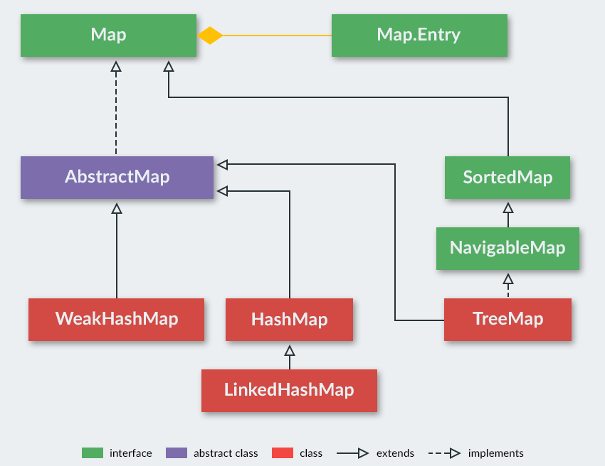
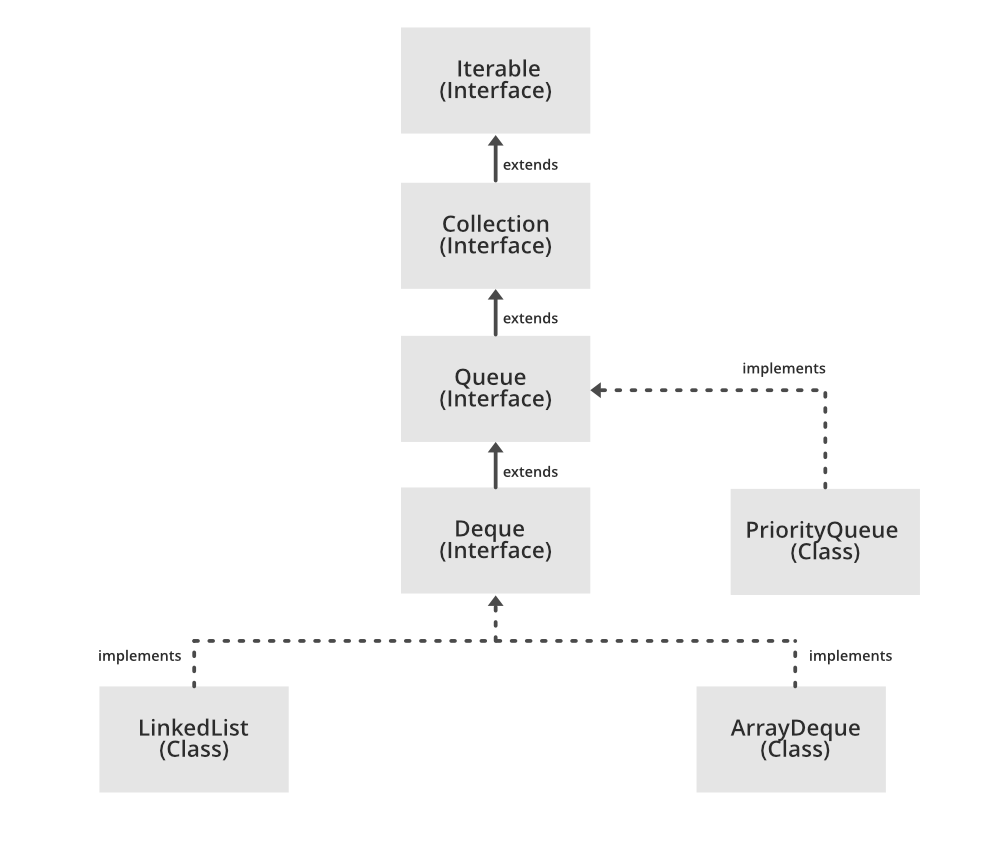

# 컬렉션 프레임워크 - `Map`, `Stack`, `Queue`

## `Map`
- 키-값 쌍을 저장하는 자료구조
- `Map`은 `Key`와 `Value`로 이루어짐
- 일반적으로 `HashMap`을 사용 

### `HashMap`
- 해시를 사용해서 키-값 엔트리를 저장하며, 엔트리간 순서가 보장되지 않음
- 키는 해시 함수를 통해 해시 코드로 변환되며, 해당 해시 코드로 요소를 조회 및 수정함
- 연산은 일반적으로 `O(1)`의 시간 복잡도를 가짐

#### 내부 구조
- 해시 충돌이 발생할 경우를 대비해 버킷을 사용함
- 하나의 버킷에는 여러 엔트리가 저장될 수 있으며, 해시 충돌이 발생할 경우 연결 리스트나 트리로 저장됨
- 버킷에 저장된 엔트리가 8개 이상이면 연결 리스트에서 레드-블랙 트리로 변환하여 조회 성능을 `O(1)`에 가깝게 유지함

> **참고**  
> `HashSet`은 내부적으로 `Value`가 없는 `HashMap`을 사용하여 구현됨  
> 즉, `HashSet`에 저장되는 데이터는 `HashMap`의 `Key`로 저장되며, `Value`에는 더미 값이 들어감

### `LinkedHashMap`
- 이중 연결 리스트를 사용해 엔트리의 삽입 순서가 보장됨 
- 연산은 일반적으로 `O(1)`의 시간 복잡도를 가짐

### `TreeMap`
- 레드-블랙 트리를 기반으로 구현됨
- 엔트리들은 기본적으로 엔트리의 키를 기준으로 정렬하여 저장됨
- 연산은 일반적으로 `O(log n)`의 시간 복잡도를 가짐

 

## `Stack`
- `Stack` 클래스는 내부적으로 `Vector`를 상속받아 구현됨
- `Vector`는 `synchronized` 메서드를 사용해 성능상 불리하며 현재는 사용이 권장되지 않음
- 따라서 스택이 필요한 경우, `Stack` 클래스 대신 `Deque` 사용이 권장됨

 

## `Queue`
- `ArrayDeque` 구현체를 사용하는 것이 권장됨
- `ArrayDeque`는 내부적으로 배열을 사용하므로 `LinkedList`에 비해 성능상의 이점이 존재함 

